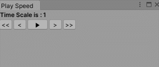

# Play Speed Tool
Allows you to alter the time scale of the game with ease.

## Prerequisites
Unity 2018.3 and up

## Usage
1. Open the package manager and point to the rep url
2. Go to Tools/PlaySpeed
3. During a play session use the buttons to change the time scale

## Previews

